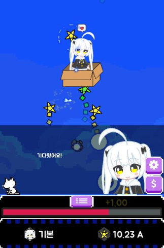

# Unity_ClickerGame_StarLight

Unity로 제작한 모바일 클릭커 게임 프로젝트입니다.  
별빛을 모아 우주선을 업그레이드하고,  
스킬, 페어리(펫), 업그레이드 시스템을 활용해 더 효율적으로 재화를 모을 수 있도록 구성했습니다.

주요 목표는 단순한 클릭 기능 구현이 아니라,  
**Json 기반 데이터 관리**, **UI 계층 구조 설계**, **스킬/세이브/다이얼로그 시스템 구현** 등  
모바일 게임에서 자주 사용하는 시스템을 직접 제작하는 것이었습니다.

> 현재 공개 버전은 광고 기능 및 인앱 결제 기능을 제거한 버전입니다.

---

## 프로젝트 소개

**StarLight**는 별빛을 모아 우주선을 업그레이드하는 모바일 클릭커 게임입니다.  
주인공 캐릭터와 상호작용할 수 있으며,  
여러 스킬과 업그레이드를 통해 자원 획득 효율을 높일 수 있습니다.

프로젝트를 진행하며 게임 플레이뿐 아니라  
데이터 로드/저장, UI 계층 구조, 스킬 쿨타임 유지, 대화 시스템, 숫자 단위 변환 등  
실제 모바일 게임 클라이언트에서 자주 다루는 시스템 구현에 집중했습니다.

---

## 개발 환경

- **Engine**: Unity 2022.3.8f1
- **Language**: C#
- **Platform**: Mobile
- **Version Control**: Git / GitHub

---

## 주요 기능

- 클릭을 통한 별빛 획득
- 우주선 업그레이드 시스템
- 스킬 사용 및 재사용 대기시간 관리
- 페어리(펫) 자동 수집 시스템
- Json 기반 게임 데이터 로드
- UI 계층 구조 관리
- 다이얼로그 시스템
- 자동 저장 시스템
- 큰 숫자 단위 축약 표시 기능

---

## 게임 시스템

### 1. JsonLoader
게임에 필요한 각종 데이터를 Json 파일로 저장하고 로드하는 시스템입니다.  
업그레이드, 스킬, 페어리 등의 데이터 관리를 Json 기반으로 구성해  
데이터 수정과 확장이 쉽도록 했습니다.

### 2. UI 계층 구조
게임 UI는 다음과 같은 계층 구조로 관리됩니다.

- **MainUI**
- **SubUI**
- **ElementUI**

`MainUI → SubUI → ElementUI` 순으로 구조화하여  
전체 UI를 체계적으로 업데이트하고 유지보수하기 쉽도록 설계했습니다.

### 3. 스킬 시스템
스킬의 재사용 대기시간은 `UserData`에 저장되며,  
게임 종료 시점에 쿨타임이 진행 중인 스킬이 있으면  
다음 게임 시작 시점에도 이어서 반영되도록 구현했습니다.

또한 각 스킬의 이름, 설명, 쿨타임 등 기본 정보는 Json 파일에서 로드되도록 구성했습니다.

### 4. 페어리 시스템
페어리(펫)를 구매하면 자동으로 일정 시간마다 별빛을 수집합니다.  
페어리 관련 데이터 역시 Json 파일로 관리하며,  
이미 구매한 페어리는 업그레이드할 수 있고 다음 페어리 구매 기능이 해금됩니다.

### 5. 업그레이드 시스템
각종 업그레이드 데이터 역시 Json 파일로 로드됩니다.  
UI 아이콘을 탭하면 캐릭터가 해당 업그레이드에 대한 설명을 제공하도록 구성했습니다.

### 6. 다이얼로그 시스템
직접 정의한 양식에 맞춰 텍스트를 입력하면 이를 파싱하여,  
대화 단위마다 표정, 말풍선 종류, 특정 애니메이션 재생 여부 등을 지정할 수 있도록 구현했습니다.

주요 특징:
- 한 글자씩 출력
- 기본 입 모양 애니메이션 재생
- 출력 중 터치 시 현재 문장을 한 번에 표시

캐릭터 대사는 Json 파일로 저장해 관리했습니다.

### 7. 세이브 시스템
일정 시간마다 유저 데이터를 자동 저장합니다.  
저장은 `PlayerPrefs`를 사용했고, 저장 데이터는 Base64로 인코딩했습니다.

### 8. 숫자 단위 변환 시스템
클릭커 게임 특성상 큰 숫자를 자주 표현해야 하기 때문에,  
`GetUnitText()` 함수를 구현해 숫자를 천 단위 기준으로 축약하여 출력하도록 구현했습니다.

예시:
- 1,000 → `1.00 A`
- 1,000,000 → `1.00 B`

---

## 프로젝트에서 중점적으로 고민한 점

### 1. 데이터 중심 구조
스킬, 페어리, 업그레이드, 다이얼로그 등  
게임 데이터를 Json 파일 기반으로 구성해 확장성과 관리 편의성을 높였습니다.

### 2. UI 구조화
UI가 복잡해질수록 유지보수가 어려워지기 때문에  
MainUI / SubUI / ElementUI 구조를 나누어 역할을 분리했습니다.

### 3. 게임 종료 후 상태 유지
스킬 재사용 대기시간처럼 게임을 종료해도 이어져야 하는 요소를  
UserData에 저장해 다시 접속했을 때 자연스럽게 이어지도록 설계했습니다.

### 4. 클릭커 장르에 맞는 숫자 표현
재화 수치가 매우 커지는 장르 특성을 고려해  
큰 숫자를 직관적으로 보여줄 수 있는 단위 축약 기능을 구현했습니다.

---

## 프로젝트에서 배운 점

이 프로젝트를 통해 Unity에서 단순한 기능 구현을 넘어서,  
**데이터 관리**, **UI 구조 설계**, **세이브 시스템**, **상태 유지**, **게임 특화 표현 방식**을  
어떻게 구성해야 하는지 실전적으로 경험할 수 있었습니다.

특히 클릭커 게임처럼 수치 변화가 많고  
UI 갱신이 빈번한 장르에서 구조 분리가 얼마나 중요한지 배울 수 있었습니다.

---

## 개선하고 싶은 점

- README에 실제 플레이 화면 GIF 및 시스템 흐름도 추가
- 세이브 데이터 구조 개선
- UI 업데이트 구조 추가 정리
- 프로젝트 문서화 강화
- 모바일 최적화 보완
